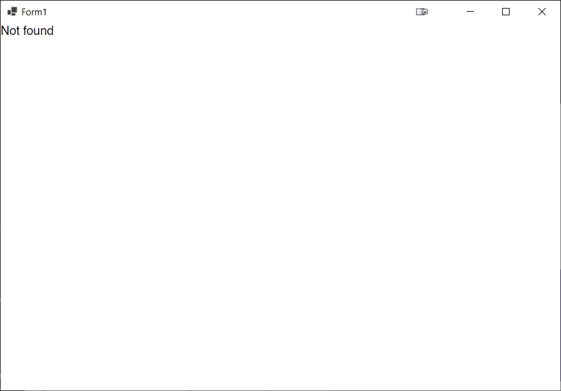
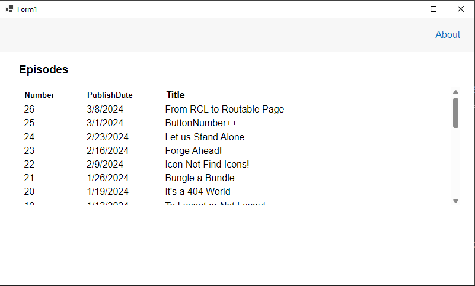

# Blazor Puzzle #31

## Re-use This!

YouTube Video: https://youtu.be/KyTeMXhep0k

Blazor Puzzle Home Page: https://blazorpuzzle.com

### The Challenge:

Carl and Jeff want to know why they can't drop an existing Blazor page into a Blazor Hybrid app.

We have copied a Blazor page file (*Episodes.razor*) from a Blazor project into a Blazor Hybrid Windows Forms app. Here's the component:

*Episodes.razor*:

```c#
@page "/episodes"
@using Microsoft.AspNetCore.Components.QuickGrid

<h3>Episodes</h3>

<div style="height:200px; overflow-y: scroll">
	<QuickGrid Items="@_Episodes.AsQueryable()">
		<PropertyColumn Property="@(e => e.Number)" Sortable="true" />
		<PropertyColumn Property="@(e => e.PublishDate)" Sortable="true" />
		<PropertyColumn Property="@(e => e.Title)" />
	</QuickGrid>
</div>

@code {

	private static readonly Episode[] _Episodes = [
				new Episode(26, new(2024,3,8), "From RCL to Routable Page"),
	new Episode(25, new(2024,3,1), "ButtonNumber++"),
	new Episode(24, new(2024,2,23), "Let us Stand Alone"),
	new Episode(23, new(2024,2,16), "Forge Ahead!"),
	new Episode(22, new(2024,2,9), "Icon Not Find Icons!"),
	new Episode(21, new(2024,1,26), "Bungle a Bundle"),
	new Episode(20, new(2024,1,19), "It's a 404 World"),
	new Episode(19, new(2024,1,12), "To Layout or Not Layout"),
	new Episode(18, new(2024,1,4), "Where's the Config?"),
	new Episode(17, new(2023,12,22), "Whether or Not"),
	new Episode(16, new(2023,12,15), "No Message for You!"),
	new Episode(15, new(2023,12,8), "Unexpected Behavior"),
	new Episode(14, new(2023,12,1), "Simple App Doesn't Work"),
	new Episode(13, new(2023,11,16), "Upgrade This App!"),
	new Episode(12, new(2023,11,9), "Build a Better Background Service"),
	new Episode(11, new(2023,11,2), "Build a Better State Bag"),
	new Episode(10, new(2023,10,27), "Stop the Rendering"),
	new Episode(9, new(2023,10,20), "A Matter of Focus"),
	new Episode(8, new(2023,10,13), "A Printing Puzzle"),
	new Episode(7, new(2023,10,6), "A Parameter Problem #2"),
	new Episode(6, new(2023,9,29), "A Parameter Problem"),
	new Episode(5, new(2023,9,22), "Localization Woes"),
	new Episode(4, new(2023,9,15), "Lazy Not Loading!"),
	new Episode(3, new(2023,9,8), "JavaScript Calling!"),
	new Episode(2, new(2023,9,1), "Got JavaScript?"),
	new Episode(1, new(2023,8,25), "Introducing the Blazor Puzzle")
			];

	public record Episode(int Number, DateOnly PublishDate, string Title);

}
```

The Windows Forms app's Form1 is configured to load the BlazorWebView and load the Episodes page:

*Form1.cs*:

```c#
using Microsoft.AspNetCore.Components.WebView.WindowsForms;
using Microsoft.Extensions.DependencyInjection;
using System.Diagnostics.Metrics;

namespace MyWindowsFormsApp
{
	public partial class Form1 : Form
	{
		public Form1()
		{
			InitializeComponent();

			var services = new ServiceCollection();
			services.AddWindowsFormsBlazorWebView();
			blazorWebView1.HostPage = "wwwroot\\index.html";
			blazorWebView1.Services = services.BuildServiceProvider();
			blazorWebView1.RootComponents.Add<Routes>("#app");
			blazorWebView1.StartPath = "/episodes";

		}
	}
}
```

When we run the Windows Forms app, this is what we get:



Why are we getting a **Not Found** error in the WebView control?

### The Solution:

The solution is to set the **Build Action** property of the linked *Episodes.razor* file to **Content** as shown here:


That's all there is to it!



